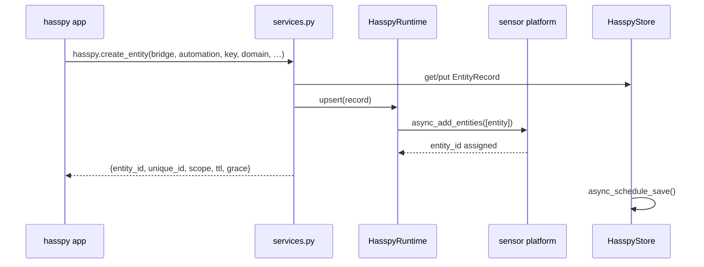

# Architecture

```
           ┌──────────────────────────────┐        ┌──────────────────────────────┐
           │  hasspy (production)         │        │  hasspy (debug)              │
           │  python -m hasspy            │        │  python -m hasspy            │
           └───────────────┬──────────────┘        └───────────────┬──────────────┘
                           │  HA WebSocket API                      │
                           ▼                                       ▼
           ┌───────────────────────────────────────────────────────────────────────┐
           │  Home Assistant                                                       │
           │                                                                       │
           │  ┌──────────────────────── custom_components/hasspy ──────────────┐  │
           │  │  services.py   register_bridge / heartbeat / create_entity /    │  │
           │  │                set_entity_state / delete_entity / release_…     │  │
           │  │  runtime.py    HasspyRuntime  (store + live entities + platforms)│ │
           │  │  store.py      HasspyStore  ──►  .storage/hasspy.dynamic         │  │
           │  │  entity.py     HasspyDynamicEntity  (+ sensor / binary_sensor)   │  │
           │  │  bridge.py     fixed per-bridge presence entities                │  │
           │  │  debug.py      DebugCollector (lease → stale → collected)       │  │
           │  └──────────────────────────────────────────────────────────────────┘  │
           └───────────────────────────────────────────────────────────────────────┘
```

## Lifecycle of a `create_entity` call



## Where each concern lives

| Concern | File |
| --- | --- |
| Public contract (services, schemas) | `services.py`, `services.yaml` |
| Persistent model + IDs | `store.py` |
| Live entity map, platforms, device registry | `runtime.py` |
| Entity behaviour / availability | `entity.py`, `sensor.py`, `binary_sensor.py` |
| Fixed presence entities | `bridge.py` |
| Debug lease/GC state machine | `debug.py` |
| Setup / teardown | `__init__.py`, `config_flow.py` |

## Persistence and restart

Everything is in one `Store` (`.storage/hasspy.dynamic`). On boot the platforms
re-spawn every stored record **before** hasspy reconnects, so entity_ids are
stable across restarts. A record's `unique_id` (`bridge|automation|key`) is the
contract; home-assistant derives the `entity_id` from the record's `name` /
`object_id` with a collision suffix, so a user rename in the UI is preserved.

## The hasspy side

The write path needs **no hasspy library change** — `call_service` is enough:

```python
self.call_service(
    "hasspy.create_entity",
    data={"bridge": "production", "automation": "roller#0",
          "key": "up", "domain": "sensor",
          "device_class": "timestamp", "state": next_sunrise.isoformat()},
    return_response=True,
)
```

The hasspy library now also ships a small reporter (`hasspy/reporter.py`, wired
into `start_hasspy` / `add_automation` / `Automation`) that announces the process
as a bridge, heartbeats it, and records per-automation last-event/error counts.
It also adds `Automation.create_entity()` / `set_entity_state()` convenience
wrappers. All of it is best-effort and auto-detects whether this integration is
installed. It ships through the hasspy image (`build.sh`), not through HACS —
see `docs/HASSPY_REPORTER.md`.
