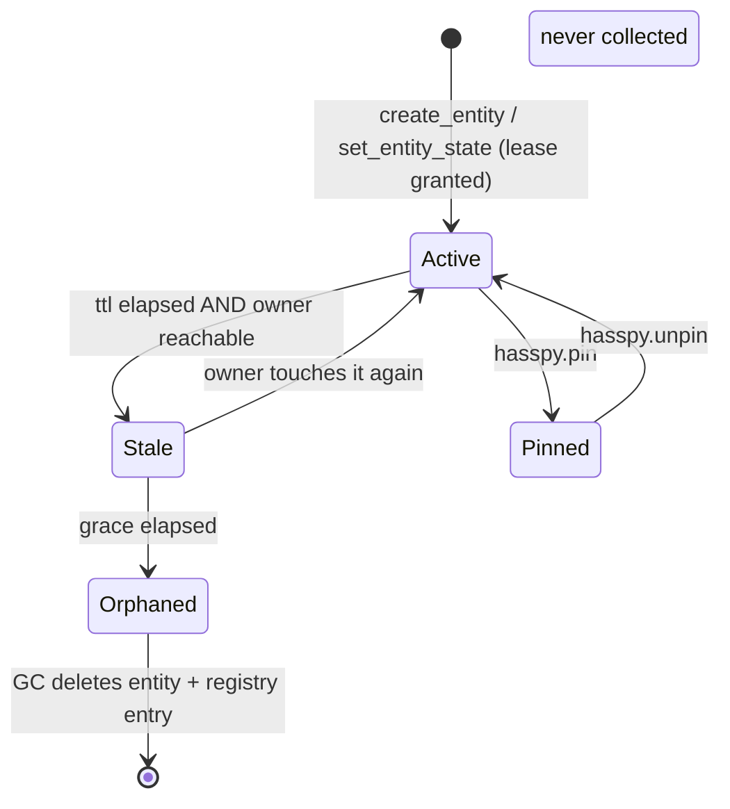

# Debug entities — concept

> The short version: a debug entity is **not** deleted when its automation stops
> touching it. It is *demoted* to `unavailable` and kept for a grace window, and
> every countdown is frozen while its owning hasspy process is unreachable.

## The problem

During development you run a second hasspy (`bridge: debug`) next to production.
Its apps create plenty of junk sensors — intermediate results, plan dumps,
computed indicators. You want them cleaned up when you are done, *without*:

* deleting the entities a crashed production automation was writing (you need
  those to investigate the crash — possibly hours later);
* deleting entities because the *whole hasspy container* was restarting, the
  network blipped, or HA itself was updating;
* leaving orphans forever when a run dies ungracefully.

A naive `TTL → delete` fails the second point. A naive "delete when the
automation is no longer active" fails it even harder, because a crashed
automation *is* no longer active.

## The model

Each dynamic entity carries four extra pieces of bookkeeping:

| Field | Meaning |
| --- | --- |
| `scope` | `production` (never collected) or `debug` (lease-managed) |
| `last_seen` | When the owner last created/updated it |
| `stale_since` | Set when its lease first lapsed; `null` while active |
| `pinned` | Manual GC exemption |
| `ttl` | Lease length, seconds (default **60**) |
| `grace` | Retention after going stale, seconds (default **6 h**) |

Plus, per bridge, a `last_seen` heartbeat and `stale_after` (default 120 s).

### Three states, not two



`Stale` is the important one: the entity **stays in the UI** (state
`unavailable`) for the whole grace window. You can still see what it held and
what attributes it carried. Only after grace does it become `Orphaned` and get
deleted.

### The four rules

1. **Aging is relative to bridge liveness.** If the bridge's heartbeat is older
   than `stale_after`, every clock for its entities is frozen: nothing goes
   stale, nothing is collected. A crashed automation therefore cannot be
   cleaned up while its process is down.
2. **Grace is measured from the later of "went stale" and "bridge came back".**
   A bridge that was down for 10 h returns to a *restarted* grace window, not to
   a mass deletion.
3. **Explicit release beats any timer.** A debug run that exits cleanly calls
   `hasspy.release_session` and its entities vanish immediately. TTL exists only
   for the ungraceful case.
4. **Pin is the escape hatch.** `hasspy.pin` keeps everything a run created,
   forever, and revives anything that already went stale.

### Why this handles "the production automation crashed for a few hours"

Take the exact scenario: production app crashes at 02:00, you look at 09:00.

* 02:00 crash. The container may stay up (the crash is inside one app) or die.
* If the **container is up**: the process keeps heartbeating, so the bridge is
  live. The crashed app's debug entities go `stale` after 60 s, then sit
  `unavailable` for the 6 h grace counted from 02:01 → collected ~08:01. Hmm —
  *just* inside your window. Bump `grace` to 12–24 h if that margin is too thin.
* If the **container is down**: the heartbeat goes stale after 120 s and
  everything freezes. Nothing is lost no matter how long you are away, until
  the container comes back and the grace window then runs from that moment.

So the recommendation is to set `grace` generously (6 h default, 24 h if you
debug rarely) and rely on `release_session` for the common case.

## Operating it

```yaml
# a debugging hasspy run, on startup
- service: hasspy.register_bridge
  data:
    bridge: debug
    name: "hasspy (debug)"
    scope: debug
    ttl: 60
    grace: 21600
# every 30 s
- service: hasspy.heartbeat
  data: { bridge: debug }
# on a clean exit
- service: hasspy.release_session
  data: { bridge: debug }
```

From Developer Tools → Actions:

* `hasspy.sweep` with `dry_run: true` → what *would* be collected, and why.
* `hasspy.list_entities` with `scope: debug` → every debug entity with
  `stale`, `pinned`, `ttl`, `last_seen`.
* `hasspy.pin` with `bridge: debug` → freeze cleanup so you can dig in.

## Edge cases handled

| Case | Behaviour |
| --- | --- |
| HA restart | Store-backed; entities are rebuilt with the same `entity_id`s. |
| hasspy container restart | Bridge re-registers; stale debug entities are re-adopted by the new `run_id`. |
| DST / clock jumps | All math is on UTC epoch seconds (`time.time()`), never wall-clock. |
| Recorder churn | Volatile attrs are in `_unrecorded_attributes`. |
| Two bridges, same key | Scoped by `unique_id = bridge\|automation\|key`. |
| Production app dies | Its entities are `scope: production` and are never collected. |

## Known limitations

* Only `sensor` and `binary_sensor` are implemented as dynamic domains; adding
  more is a small platform module + one entry in `entity.build_entity`.
* A debug entity is only as trustworthy as its owner's heartbeat: a process that
  keeps heartbeating while its app is dead will eventually age the app's
  entities out (rule 1). That is why `grace` defaults high.
* Anyone holding a long-lived HA token can call the create service. The
  integration trusts the token, exactly as hasspy does today.
